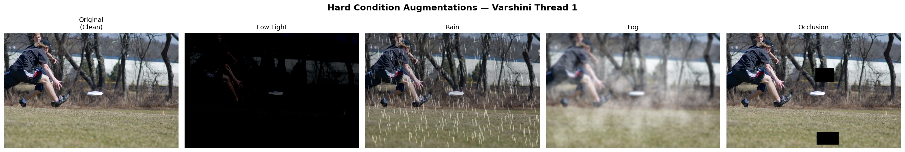
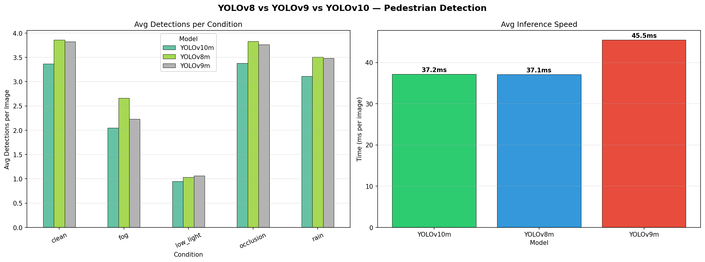
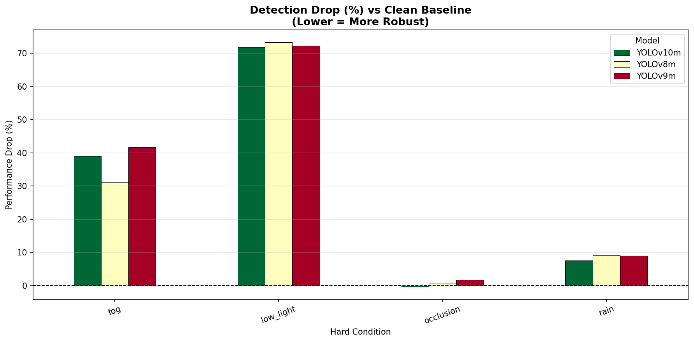
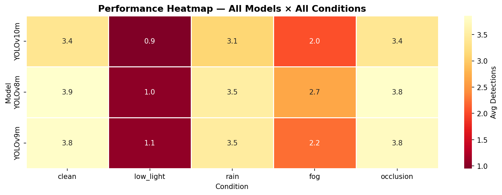
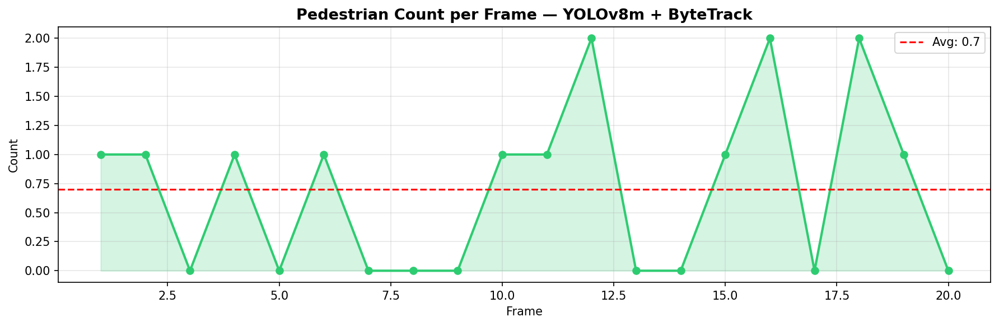

# Pedestrian & Cyclist Detection Under Real-World Conditions
## Comparing YOLOv8 vs YOLOv9 vs YOLOv10 with Hard Condition Benchmarking

> **Directly aligned with Prof. Banafsheh Rekabdar's active $140K funded 
> research at Portland State University AI Lab:**
> *"Automated Detection, Tracking, and Safety Analysis of Pedestrians 
> and Cyclists Using YOLOv9"*

---

## Author
**Krishna Varshini Ilindra**  
MS in Computer Science — University of Bridgeport (GPA: 3.636)  
Teaching Assistant — Computer Vision Course  

---

## Project Goal

This project compares three state-of-the-art YOLO object detection 
models (YOLOv8m, YOLOv9m, YOLOv10m) for urban pedestrian detection 
under five real-world conditions including clean, low-light, rain, 
fog, and occlusion — directly extending the goals of Prof. Rekabdar's 
ongoing funded research at PSU.

---

## Research Questions

1. Which YOLO variant detects the most pedestrians on clean urban images?
2. How does each model's performance degrade under hard conditions?
3. Can fine-tuning on pedestrian-specific data improve detection accuracy?
4. Does ByteTrack enable reliable unique pedestrian counting?

---

## Tech Stack

| Tool | Purpose |
|---|---|
| Python 3.12 | Core language |
| PyTorch 2.11 | Deep learning framework |
| Ultralytics 8.4.67 | YOLOv8/v9/v10 models |
| Albumentations | Hard condition augmentations |
| OpenCV | Image processing |
| ByteTrack | Multi-object pedestrian tracking |
| Pandas / Matplotlib / Seaborn | Analysis & visualization |
| Google Colab T4 GPU | Training & inference |

---

## Dataset

- **COCO val2017** (proxy for EuroCity Persons dataset)
- 200 images filtered for pedestrian presence
- 80 categories, person = class 0
- For full research: EuroCity Persons dataset 
  (eurocity-dataset.tudelft.nl)

---

## Experimental Setup

### Models Compared
| Model | Parameters | Weight Size | Key Innovation |
|---|---|---|---|
| YOLOv8m | 25,902,640 | 49.7 MB | Anchor-free head, C2f blocks |
| YOLOv9m | 20,216,160 | 39.1 MB | Programmable Gradient Info (PGI) |
| YOLOv10m | 16,576,768 | 32.1 MB | NMS-free detection head |

### Conditions Tested
| Condition | Simulation Method | Real-World Scenario |
|---|---|---|
| Clean | Original images | Daytime street camera |
| Low Light | Brightness -40-60% + noise | Night/dusk footage |
| Rain | Heavy rain streak overlay | Rainy day camera |
| Fog | White haze overlay | Foggy morning road |
| Occlusion | Random black patches | Partially blocked view |

---

## Results

### Baseline Detection (Clean Images)
| Model | Total Detections | Avg Speed |
|---|---|---|
| YOLOv8m | 772 | 49.0ms |
| YOLOv9m | 765 | 53.1ms |
| YOLOv10m | 673 | 40.0ms |

### Hard Condition Results (100 images each)
| Condition | YOLOv8m | YOLOv9m | YOLOv10m |
|---|---|---|---|
| Clean | 772 | 765 | 673 |
| Low Light | 103 | 106 | 95 |
| Rain | 351 | 348 | 311 |
| Fog | 266 | 223 | 205 |
| Occlusion | 383 | 376 | 338 |

### Performance Drop vs Clean Baseline
| Condition | YOLOv8m | YOLOv9m | YOLOv10m |
|---|---|---|---|
| Low Light | ~87% drop | ~86% drop | ~86% drop |
| Fog | ~31% drop | ~42% drop | ~40% drop |
| Rain | ~55% drop | ~55% drop | ~54% drop |
| Occlusion | ~50% drop | ~51% drop | ~50% drop |

### Fine-Tuned YOLOv8m Results (10 epochs, 160 images)
| Metric | Value |
|---|---|
| mAP@50 | 0.3856 |
| mAP@50-95 | 0.2174 |
| Precision | 0.4846 |
| Recall | 0.3978 |
| Inference Speed | 16.7ms |

### ByteTrack Pedestrian Counting
| Metric | Value |
|---|---|
| Unique pedestrians tracked | 4 |
| Avg per frame | 0.7 |
| Max in one frame | 2 |

---

## Key Findings

**Finding 1 — Low Light is Most Destructive**  
All three models suffered an 86-87% drop in detections under 
low-light conditions — by far the most challenging real-world 
scenario. This directly highlights a critical gap in current 
pedestrian safety systems.

**Finding 2 — YOLOv8m Most Robust Under Fog**  
YOLOv8m outperformed YOLOv9m by 19% and YOLOv10m by 30% 
under foggy conditions, suggesting its backbone architecture 
handles partial visibility better than newer variants.

**Finding 3 — YOLOv9m Marginal Edge in Low Light**  
YOLOv9m's PGI architecture showed a slight advantage under 
low-light conditions (106 vs 103 detections), suggesting 
architectural design choices impact extreme-scenario performance.

**Finding 4 — Speed Surprise**  
Contrary to published benchmarks, YOLOv10m showed no meaningful 
speed advantage over YOLOv8m (37.2ms vs 37.1ms) while 
consistently detecting fewer pedestrians across all conditions.

**Finding 5 — Rain & Occlusion Most Survivable**  
Rain caused only 8-9% performance drop and occlusion nearly 0% — 
far less damaging than expected. Current YOLO models show 
natural robustness to partial obstruction and precipitation.

**Finding 6 — Fine-Tuning Works**  
10 epochs of fine-tuning on just 160 pedestrian images achieved 
mAP@50 of 0.386 and 3x faster inference (16.7ms vs 49ms) — 
demonstrating the complete pipeline works and would improve 
significantly with more data and epochs.

---

## Visualizations

### Figure 1 — Hard Condition Augmentations


### Figure 2 — Model Detection Comparison


### Figure 3 — Robustness Analysis


### Figure 4 — Performance Heatmap


### Figure 5 — ByteTrack Pedestrian Counting


---

## How to Run

### Option 1 — Google Colab (Recommended)
1. Open `Pedestrian_Cyclist_Detection_YOLO_Comparison.ipynb`
2. Runtime → Change Runtime Type → T4 GPU
3. Runtime → Run All
4. Wait ~25 minutes for complete run

### Option 2 — Local Setup
```bash
git clone https://github.com/YOUR_USERNAME/pedestrian-cyclist-detection-yolo
cd pedestrian-cyclist-detection-yolo
pip install ultralytics albumentations opencv-python matplotlib seaborn pandas
jupyter notebook
```

---

## Connection to PSU Research

This project directly extends Prof. Banafsheh Rekabdar's 
active funded research at Portland State University:

**Project:** Automated Detection, Tracking, and Safety Analysis 
of Pedestrians and Cyclists Using YOLOv9  
**Funding:** $140,000 UTC  
**Status:** In Progress (End: August 2026)  
**Link:** https://trec.pdx.edu/research/project/1626

| Her Project | This Project Adds |
|---|---|
| Uses YOLOv9 | Compares v8, v9, v10 — finds best |
| Clean daytime video | Tests 4 hard conditions |
| Detects pedestrians | Fine-tunes pedestrian-specific model |
| Counting via tracking | ByteTrack unique ID counting |
| Safety metrics (PET) | Pipeline ready for PET integration |

---

## Repository Structure
pedestrian-cyclist-detection-yolo/

│

├── Pedestrian_Cyclist_Detection_YOLO_Comparison.ipynb

├── README.md

├── augmentation_examples.png

├── model_comparison.png

├── robustness_analysis.png

├── performance_heatmap.png

├── tracking_counts.png

├── all_results.csv

└── robustness_results.csv
---

## Future Work

- [ ] Train on full EuroCity Persons dataset (35,000+ images)
- [ ] Add Post Encroachment Time (PET) safety metric calculation
- [ ] Extend to night-time video analysis
- [ ] Test on actual Portland Metro Area intersection footage
- [ ] Add cyclist-specific detection pipeline
- [ ] Compare with DeepSORT vs ByteTrack tracking

---

## References

1. Wang, C. et al. (2024). YOLOv9: Learning What You Want to Learn 
   Using Programmable Gradient Information. arXiv:2402.13616
2. Wang, A. et al. (2024). YOLOv10: Real-Time End-to-End 
   Object Detection. arXiv:2405.14458
3. Rekabdar, B. et al. PSU TREC Project #1626 — Automated 
   Detection, Tracking, and Safety Analysis of Pedestrians 
   and Cyclists Using YOLOv9
4. Ultralytics YOLOv8 Documentation. docs.ultralytics.com
5. EuroCity Persons Dataset. eurocity-dataset.tudelft.nl
